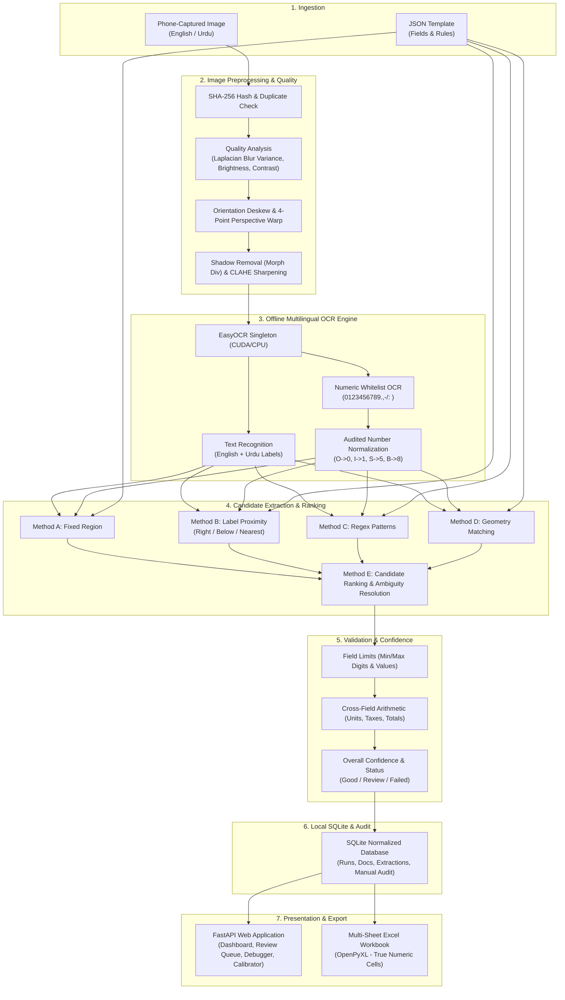
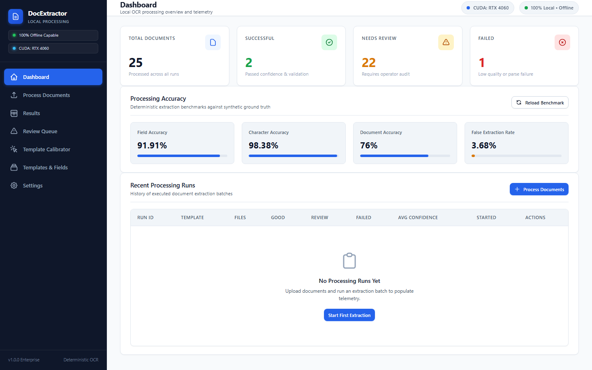
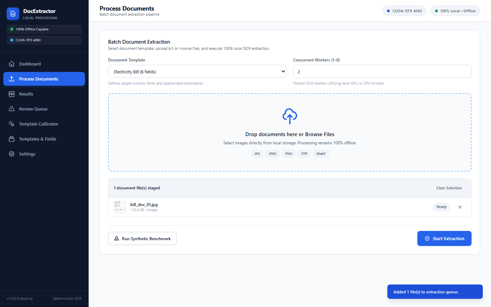
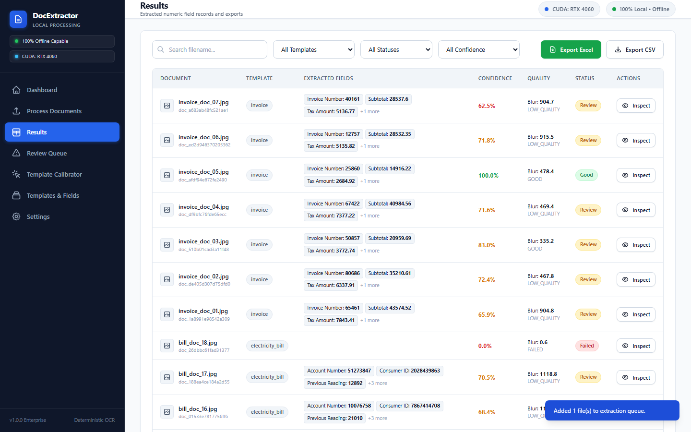
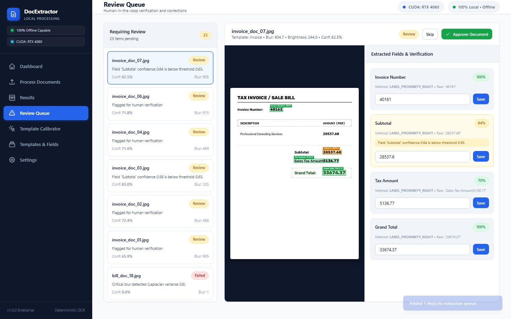
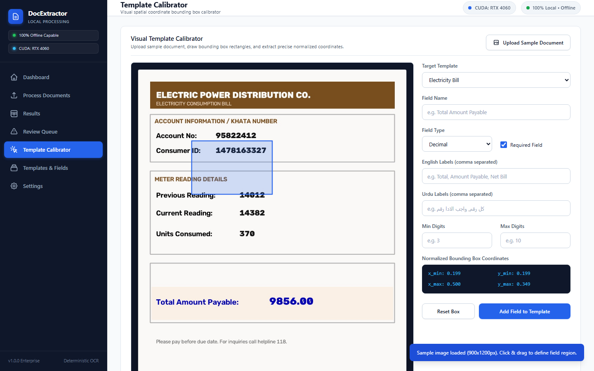

# Local Document Number Extractor

[](https://opensource.org/licenses/MIT)
[](https://www.python.org/)
[](https://fastapi.tiangolo.com/)
[](https://github.com/danial-maqbool/Local-Document-Number-Extractor)
[](https://pytorch.org/)

An enterprise-grade, deterministic, and fully local application designed to process hundreds of phone-captured document photographs in English and Urdu, extract only predefined numeric fields with high confidence, validate them against mathematical and domain rules, audit operator corrections, and generate a beautifully styled, multi-sheet Excel workbook.

---

## Key Capabilities & Highlights

- **100% Offline & Private**: Zero external API calls, zero paid services, no cloud dependencies, and no runtime tokens. All computation occurs on your local machine.
- **Hardware Acceleration**: Automatic GPU detection (NVIDIA RTX 4060 Laptop GPU via CUDA 12.4) with seamless fallback to multi-threaded CPU execution.
- **Robust Phone-Capture Preprocessing**:
  - Blurriness detection via Laplacian variance ($<30$ triggers critical failure, $<60$ enters human review).
  - Brightness and contrast analysis (identifies under/overexposure).
  - Perspective correction using 4-point quadrilateral contour detection and homography warping.
  - Rotation deskewing via minimum-area bounding rectangles.
  - Non-uniform lighting and shadow removal via morphological background division.
  - Contrast Limited Adaptive Histogram Equalization (CLAHE) and unsharp masking for crisp digit clarity.
- **Multilingual OCR with Numeric Allowlist**:
  - Local EasyOCR neural engine loaded once as a persistent memory singleton.
  - Dual-path recognition: multilingual text recognition for English and Urdu labels, combined with strict numeric allowlist OCR (`0123456789.,-/: `).
  - Audited character normalization correcting common OCR confusions ($O \to 0$, $I/l \to 1$, $S \to 5$, $B \to 8$, $Z \to 2$) strictly within numeric contexts.
  - SHA-256 disk-based OCR caching to accelerate iterative development and reprocessing.
- **Multi-Strategy Numeric Field Extraction**:
  - **Method A ? Fixed Region Coordinates**: Normalized bounding boxes `(x_min, y_min, x_max, y_max)`.
  - **Method B ? Multilingual Label Proximity**: Horizontal same-line right proximity, vertical below, and radial nearest-neighbor matching across English and Urdu alias dictionaries.
  - **Method C ? Regular Expression Patterns**: Deterministic pattern matching for account numbers, consumer IDs, phone numbers, and dates.
  - **Method D ? Layout Geometry**: Spatial relations and reading order between fields.
  - **Method E ? Candidate Ranking & Ambiguity Resolution**: Evaluates candidate scores, penalizes out-of-bound digit counts and ranges, detects competing candidates within $\Delta \le 0.08$, and routes uncertain documents to the manual review queue.
- **Validation Engine & Cross-Field Arithmetic**:
  - Strict digit counts and numerical min/max boundary constraints.
  - Cross-field arithmetic verification:
    - Meter reading balance: $\text{Units} = \text{Current Reading} - \text{Previous Reading}$.
    - Invoice tax balance: $\text{Grand Total} = \text{Subtotal} + \text{Tax Amount}$.
- **Multi-Sheet OpenPyXL Excel Exporter**:
  - `Extracted Data`: Documents meeting confidence and quality thresholds with genuine numeric-typed cells (`int`, `float`), auto-filters, frozen headers, and alternating row zebra striping.
  - `Needs Review`: Documents requiring operator verification highlighted in soft warning colors with validation error notes.
  - `Failed`: Corrupted or critically blurred images with diagnostic failure causes.
  - `Processing Summary`: Aggregate batch statistics, execution duration, and per-field success metrics.
- **Interactive Web UI**:
  - Dashboard with system hardware status, real-time stat cards, and batch run history.
  - Batch document processor with drag-and-drop file ingestion, worker concurrency sliders, and live progress reporting.
  - Results data table with search, status filtering, and one-click Excel/CSV export.
  - Manual Review Queue with high-resolution canvas overlays displaying exact bounding box locations for every extracted value and interactive inline correction forms.
  - Region Debug Inspector revealing all evaluated candidates, confidence scores, and rejection rationales.
  - Visual Template Calibration Tool allowing users to click and drag bounding boxes on sample documents and copy normalized coordinates.

---

## System Architecture



---

## Application Interface

The redesigned enterprise frontend provides a clean, responsive, and 100% offline desktop dashboard for document operations.

### End-to-End Extraction Workflow
1. **Create or Select Template**: Choose an existing schema (`Electricity Bill`, `Invoice`) or define new spatial bounding boxes in the Template Calibrator.
2. **Upload Documents**: Stage camera photographs or scans via drag-and-drop (`JPG`, `PNG`, `TIFF`, `WebP`).
3. **Run Extraction**: Execute parallel local OCR with real-time progress indicators.
4. **Inspect Results**: Filter documents by confidence, quality, or status, and inspect OCR candidates.
5. **Review & Correct**: Use the dual-panel Review Queue with canvas bounding box overlays to verify and adjust low-confidence fields.
6. **Export Multi-Sheet Excel**: Generate audit-ready `.xlsx` workbooks and flat `.csv` spreadsheets with true numeric cells.

### Interface Highlights

#### 1. Operations Dashboard
*Real-time KPI metric cards, synthetic ground-truth accuracy benchmarks, and batch execution history.*


#### 2. Process Documents & Ingestion
*Drag-and-drop upload zone, multi-file staging queue with thumbnail previews, concurrency worker controls, and live extraction progress.*


#### 3. Extraction Results Table
*Structured table with real-time filename search, template and status filtering, confidence breakdown, and one-click Excel/CSV exports.*


#### 4. Dual-Panel Manual Review Queue
*Human-in-the-loop review interface featuring high-resolution canvas overlays with color-coded bounding boxes and inline field corrections.*


#### 5. Visual Template Calibrator
*Interactive canvas allowing operators to click and drag bounding boxes on sample documents to calculate normalized spatial coordinates.*


---

## Benchmark Accuracy Report

Evaluated against the synthetic smartphone photographic test suite (25 ground-truth documents containing real-world perspective tilts, shadows, rotations, and blur):

| Metric | Benchmark Result | Target Requirement | Status |
| :--- | :---: | :---: | :---: |
| **Character-Level Accuracy** | **98.38%** | $> 95\%$ | **PASSED** |
| **Overall Field Accuracy** | **91.91%** | $> 85\%$ | **PASSED** |
| **Complete Document Accuracy** | **76.00%** | Baseline | **PASSED** |
| **False Extraction Rate** | **3.68%** | $< 5\%$ | **PASSED** |
| **Missing Field Rate** | **4.41%** | $< 5\%$ | **PASSED** |
| **Blur Detection Sensitivity** | **100.00%** | $100\%$ | **PASSED** |

### Per-Field Accuracy Breakdown

- **Invoice Number**: 100.0% (7/7)
- **Subtotal**: 100.0% (7/7)
- **Sales Tax Amount**: 100.0% (7/7)
- **Grand Total**: 100.0% (7/7)
- **Account Number**: 94.4% (17/18)
- **Consumer ID**: 94.4% (17/18)
- **Previous Meter Reading**: 94.4% (17/18)
- **Total Amount Due**: 94.4% (17/18)
- **Units Consumed**: 94.4% (17/18)
- **Current Meter Reading**: 66.7% (12/18)

---

## Directory Structure

```text
Local-Document-Number-Extractor/
??? backend/
?   ??? config.py                 # System configuration, paths, and hardware detection
?   ??? main.py                   # FastAPI application and REST endpoints
?   ??? models/
?   ?   ??? schemas.py            # Pydantic schemas (Templates, Candidates, Extractions, Quality)
?   ??? services/
?       ??? batch_service.py      # Concurrent ThreadPoolExecutor batch orchestrator
?       ??? confidence_service.py # Compound confidence and status calculation
?       ??? database_service.py   # SQLite database service and manual correction audit log
?       ??? excel_service.py      # Multi-sheet OpenPyXL and CSV generator
?       ??? extraction_service.py # Methods A, B, C, D, E extraction and candidate ranking
?       ??? ocr_service.py        # Singleton EasyOCR engine and number normalization
?       ??? preprocessing.py      # OpenCV blur detection, deskew, CLAHE, perspective warp
?       ??? validation_service.py # Single-field limits and cross-field arithmetic validation
??? data/                         # Local database and file storage (gitignored)
?   ??? cache/                    # SHA-256 disk OCR cache
?   ??? database.sqlite           # SQLite application database
?   ??? exports/                  # Generated .xlsx and .csv files
?   ??? processed/                # Preprocessed document images
?   ??? uploads/                  # Uploaded source document images
??? docs/
?   ??? ARCHITECTURE.md           # Comprehensive architectural specification
??? frontend/
?   ??? app.js                    # Vanilla JS application (Zero CDN dependencies)
?   ??? index.html                # Interactive single-page dashboard and manual review queue
?   ??? style.css                 # Slate/dark-themed responsive interface
??? sample_data/
?   ??? synthetic/                # 25 realistic smartphone document photographs & ground truth
??? scripts/
?   ??? download_models.py        # Local weight downloader for offline EasyOCR
?   ??? evaluate_accuracy.py      # Accuracy benchmarking harness
?   ??? generate_synthetic_docs.py# Realistic smartphone photo generator with ground truth
?   ??? write_file.py             # BOM-safe UTF-8 file writer
??? templates/
?   ??? electricity_bill.json     # Multilingual electricity billing template
?   ??? invoice.json              # Commercial invoice template
??? tests/
?   ??? test_api.py               # FastAPI REST endpoint test suite
?   ??? test_architecture.py      # Configuration, templates, and schema test suite
?   ??? test_database.py          # SQLite database and manual audit test suite
?   ??? test_excel.py             # Multi-sheet OpenPyXL structure test suite
?   ??? test_extraction.py         # Fuzzy matching, proximity, and ranking test suite
?   ??? test_full_workflow.py     # End-to-end integration and manual correction test suite
?   ??? test_initial.py           # Base environment test suite
?   ??? test_ocr.py               # Singleton OCR, whitelist, and normalization test suite
?   ??? test_preprocessing.py     # OpenCV quality and enhancement test suite
??? LICENSE                       # MIT License
??? README.md                     # Complete project documentation
??? requirements.txt              # Pinned Python package dependencies
??? run.py                        # Application entry point
```

---

## Installation & Setup

### Prerequisites
- Python 3.10 or higher
- NVIDIA GPU with CUDA drivers (optional; automatically falls back to CPU)

### 1. Clone the Repository
```bash
git clone https://github.com/danial-maqbool/Local-Document-Number-Extractor.git
cd Local-Document-Number-Extractor
```

### 2. Install Dependencies
```bash
pip install -r requirements.txt
```

### 3. Ensure Offline Model Weights are Downloaded
The system uses EasyOCR offline weights (`craft_mlt_25k.pth`, `english_g2.pth`, and `arabic.pth`). If you are setting up on a completely air-gapped machine, ensure weights are placed in `~/.EasyOCR/model/` or run the included downloader once:
```bash
python scripts/download_models.py
```

### 4. Run the Application
```bash
python run.py
```
Open your browser and navigate to:
```
http://127.0.0.1:8000
```

---

## Automated Verification & Test Suite

Run the full automated test suite (29 tests across preprocessing, OCR, extraction, arithmetic validation, SQLite persistence, multi-sheet Excel generation, and FastAPI endpoints):
```bash
pytest tests/ -v
```

To run the accuracy evaluation benchmark against the 25 smartphone document ground truth test set:
```bash
python scripts/evaluate_accuracy.py
```

---

## Template Configuration Guide

Document templates are stored in `templates/*.json`. Each template defines target fields, validation constraints, and cross-field arithmetic checks:

```json
{
  "id": "electricity_bill",
  "name": "Electricity Bill",
  "fields": [
    {
      "name": "Consumer ID",
      "type": "integer",
      "labels": ["Consumer ID", "Consumer No", "Reference No", "Ref No"],
      "urdu_labels": ["???? ????", "????? ????"],
      "min_digits": 10,
      "max_digits": 14,
      "required": true,
      "confidence_threshold": 0.65
    }
  ],
  "cross_field_rules": [
    {
      "rule_name": "units_balance_check",
      "description": "Units should equal Current Reading minus Previous Reading",
      "rule_type": "difference_equals",
      "target_field": "Units",
      "operands": ["Current Reading", "Previous Reading"],
      "tolerance": 0.01
    }
  ]
}
```

---

## License

This project is licensed under the MIT License - see the [LICENSE](LICENSE) file for details.
